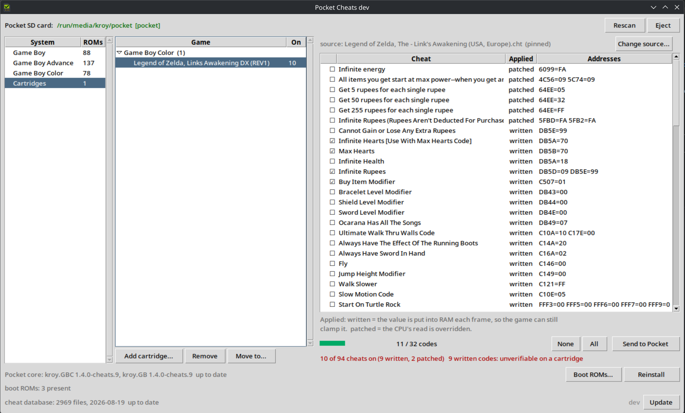

# Pocket cheat picker

A small desktop app for choosing which cheats go on an Analogue Pocket SD card,
for the Game Boy, Game Boy Color, Game Boy Advance and PC Engine /
TurboGrafx-16 cores.

> **Use at your own risk. Cheats can corrupt save files.**
>
> A cheat is not a setting, it is a write into the memory of a running game. A
> code aimed at an address that means something else in your copy overwrites
> whatever is there, and games build their save data out of that same memory,
> so the damage gets written into your save at the next save point. This is
> most dangerous on a cartridge, where the save lives in the cartridge and
> nothing on the SD card is a backup of it.
>
> Back your saves up before using cheats on anything you care about, and read
> [Cartridges](#cartridges-read-this-part) before using them on one.
>
> **Game Boy Advance and PC Engine are SD card only.** Their cores do not
> support cartridges yet, so cheats for those two go beside a ROM on the card.
> See [PC Engine](#pc-engine--turbografx-16-came-last) and
> [Game Boy Advance](#game-boy-advance-writes-two-files).

Three panes: the systems on the card, the games in each, and the cheats for the
selected game. Tick what you want and press **Send to Pocket**. The file next to
the ROM *is* the state, so what you see is what the handheld will do.



That is a cartridge rather than a ROM, which is why the status line is red: nine
of the ticked cheats are GameShark codes, and on a cartridge whose revision you
cannot check those are the dangerous kind. The **Applied** column says which is
which, and [Cartridges](#cartridges-read-this-part) explains why it matters.

## The core it writes for

This app writes cheat files. Reading them is the core's job, and stock Pocket
cores cannot do it, so the card needs one of these installed or nothing here
has any effect:

| Core | Covers | Status |
|---|---|---|
| [openfpga-GBC-cheats](https://github.com/kroy-the-rabbit/openfpga-GBC-cheats) | Game Boy, Game Boy Color | released, [download](https://github.com/kroy-the-rabbit/openfpga-GBC-cheats/releases) |
| [openfpga-GBA-cheats](https://github.com/kroy-the-rabbit/openfpga-GBA-cheats) | Game Boy Advance | released, [download](https://github.com/kroy-the-rabbit/openfpga-GBA-cheats/releases), and see [below](#game-boy-advance-writes-two-files) |
| [openfpga-pcengine-cheats](https://github.com/kroy-the-rabbit/openfpga-pcengine-cheats) | PC Engine, TurboGrafx-16 | released, [download](https://github.com/kroy-the-rabbit/openfpga-pcengine-cheats/releases), and see [below](#pc-engine--turbografx-16-came-last) |

All three are forks that add a cheat engine to somebody else's core, and each
keeps its own install notes. All three are released and verified working, and
**Cores...** in the app will fetch and install any of them onto the card for
you. The app asks each repository what its latest release is rather than being
told here, so a newly tagged core appears without this list having to be
edited.

### Installing it from here

The **Pocket core** line, above the database bar, says which core the card is
carrying and whether it is the released one:

```
Pocket core: kroy.GBC 1.4.0-cheats.9, kroy.GB 1.4.0-cheats.9  up to date
Pocket core: kroy.GBC 1.4.0-cheats.8  update available: 1.4.0-cheats.9 (kroy.GBC)
Pocket core: not installed. Nothing written here has any effect until it is.
```

**Cores...** opens a list of every core this app writes for, with the version
on the card beside the version available, and a tick box per core. What is
behind is ticked for you; everything else is yours to choose.

A row you cannot tick says why in the column that would otherwise be blank, and
the three reasons are different things: *no release published yet* is a core
whose repository is real and has not been tagged, *not released yet* is one
with no repository at all, and *release page unreachable* is you being offline.
Only the last one is fixed by trying again.

Installing writes `Cores/<id>` and the platform entries that go with the cores
you picked, and nothing else: your ROMs, saves, cheat files and boot ROMs are
not touched, and an archive naming a path outside the card is refused rather
than unpacked. Each core is downloaded whole, checked, and staged on the card
before any of it is moved into place, so an install that fails or is stopped
leaves the core you already had exactly as it was. **Eject** afterwards, before
you pull the card out.

A core already at the released version is offered but not ticked. One copied
half way reads as the right version and does not run, and putting it back is
the fix, so reinstalling stays available without being suggested.

### Boot ROMs

The core loads a boot ROM before it starts a game and will not run without one.
Those are copyrighted: they are not in the core, they are not in this app,
and this app will not fetch them. What it will do is tell you which of them
your card is missing, on the second line of the core bar, with **Boot ROMs...**
for the whole list and where each one goes:

| File | Goes in | Size |
|---|---|---|
| `gbc_bios.bin` | `Assets/gbc/common/` | 2304 bytes |
| `gb_bios.bin` | `Assets/gb/common/` | 256 bytes |
| `sgb_boot.bin` | `Assets/gb/common/` | 256 bytes |
| `gba_bios.bin` | `Assets/gba/common/` | 16384 bytes |

The PC Engine core is not in that table because it needs no boot ROM at all.
That is an answer rather than an oversight: there is nothing for you to find,
and the app never reports anything missing for it.

Dump them from your own hardware, or supply your own copies. A file of the
wrong size is reported separately from a missing one, because that is the
failure that looks like a working install and then refuses to start anything.

The list is read from the installed core's own `data.json` rather than from a
table in here, so a core that starts wanting a different file is reported
correctly by a copy of the app that predates it.

## Get the picker

Download a build from the
[releases page](https://github.com/kroy-the-rabbit/pocket-tools/releases),
or run it from a checkout:

```sh
make cheatdb          # optional: the cheat database as a git submodule
make gui              # or: cheatgui/run.sh
make list ARGS=zelda  # same data, printed, no window
```

Full install notes, and how to check the signature on a download, are in
[docs/INSTALL.md](docs/INSTALL.md).

> **All three builds have now been run on the platform they are for.** Linux
> and Windows have been used against a real Pocket card all the way through:
> reading the card, writing cheats, installing the core and ejecting. The macOS
> build has been run and works; it is still **not notarized**, so it needs one
> command to get past Gatekeeper the first time.

Python 3.10 or newer with tkinter, if you are running from source. Everything
used is in the standard library, so the venv `run.sh` makes stays empty; it
exists so nothing is ever installed into the host Python.

Full guide: [docs/CHEATGUI.md](docs/CHEATGUI.md).

## The cheat database

The app needs the libretro cheat database, about 2900 files across the three
systems. It has none on first run: press **Update** in the bar along the
bottom and it fetches one, roughly 14 MB and a minute. It comes from
[libretro/libretro-database](https://github.com/libretro/libretro-database)
and is CC-BY-SA-4.0; none of it is shipped with this app.

That bar is also the version display. It says how many files you have and what
they are dated, and it checks upstream on startup, so you can see at a glance
whether there is anything newer:

```
cheat database: 2456 files, 2026-08-01  up to date
cheat database: 2456 files, 2026-03-14  update available: 2026-08-01
cheat database: not fetched yet, press Update
```

The comparison is against the newest upstream commit that touched the two Game
Boy directories, not the repository head, which moves several times a week for
systems this core cannot run. **Update** checks first and only downloads if
there is something to download. An update that fails or is stopped leaves the
database you already had exactly as it was.

Cheat files of your own go in `~/.local/share/pocket-cheats/cht/`, outside the
database, so an update cannot lose them. They are searched first.

## Ejecting

**Eject** flushes writes and unmounts the card. Writing already syncs, but a
sync is not an unmount, and a card pulled between the two can lose the write.
If something still has the card open the app says so and leaves it mounted; it
does not force anything.

---

# Cartridges: read this part

Cheats work on a real cartridge. Everything below is about what that costs you,
because the cartridge path is the one where this tool cannot check your work and
where getting it wrong has consequences a ROM does not.

**On a cartridge, identifying the right cheat file is your job, and nothing in
this tool or in the core can do it for you or tell you that you got it wrong.**

## Why the cartridge path is different

A cartridge is not a file on the card. The app never sees it, so:

* It **never appears in the game list.** You add it yourself: the **Cartridges**
  entry in the systems pane, **Add cartridge...**, then type the name and say
  which system it is for. Your cartridges are then listed under **Game Boy**
  and **Game Boy Color** headings, and **Move to...** refiles one that went in
  under the wrong heading.
* **The system is not cosmetic.** It decides which folder on the card the
  cheat file is written to, `Assets/<system>/common/Cartridges/`. Choose the
  wrong one and the core's **Load Cheats** browser will not be looking where
  the file is.

* **The name you type is the whole of the matching.** The picker matches cheat
  files by filename. Type `Zelda` and you will be offered files for every Zelda
  ever released on the system. Nothing reads the cartridge.
* **The Pocket will not load the file by name either.** In Play Cartridge mode
  APF does not load a slot named after slot 0, so `<name>.cht` is not picked up
  automatically. Use **Load Cheats** in the core menu to browse for it once; the
  slot remembers it for later launches. The files go in their own folder,
  `/Assets/<platform>/common/Cartridges/`, so that browser opens on your
  cartridges instead of a few hundred ROMs.

With a ROM on the card, none of this applies. The app reads the actual file,
matches it, tells you which file it picked, and you can check a Game Genie
compare byte against the ROM itself. A cartridge gives you none of that.

**Add cartridge...** offers Game Boy and Game Boy Color and nothing else. Game
Boy Advance and PC Engine are SD card only: cartridges are unsupported on both
until their cores support them.

## What goes wrong, and how

You cannot tell a cartridge's revision from the outside. The label does not say,
and two carts that look identical can hold different builds with different
memory layouts. A cheat published for one revision is aimed at an address that
means something else on another. The two kinds of code then fail in completely
different ways.

### Game Genie codes fail safely

A Game Genie code carries a **compare byte**, and the core only applies the
patch when the byte already at that address matches. On the wrong revision it
never matches, so the code loads, reads as enabled, and does nothing at all.
Disappointing, not dangerous.

### GameShark codes do not

A GameShark code is a **real write into work RAM**, made once a frame, with
nothing to check against. On the wrong revision that address holds some other
variable, and the core writes over it regardless. From there:

* **Crashes.** The byte you are overwriting may be a pointer, a counter the
  game's own logic depends on, or a state machine's state. Overwritten every
  frame, forever.
* **Corrupted saves.** This is the one worth being careful about. A game builds
  its save data out of the same work RAM the code is writing into. Corrupt the
  wrong byte and the game will happily write the result into your save at the
  next save point, and it is a real cartridge, so that is the only copy.

**There is no undo.** In Play Cartridge mode the save lives in the cartridge's
own battery-backed RAM. The core reads and writes it over the edge connector
and does not copy it to the SD card, so nothing on the card is a backup of it
and a savestate is not one either. If the save matters, dump the cartridge with
a dedicated cart reader before you put a GameShark code on it. This is not
advice about this app, it is advice about writing into the RAM of a game you
cannot restore.

The app marks this where it can. The status line warns when a cartridge
selection contains written codes, and the **Applied** column says `written` or
`patched` for every cheat, so you can see which kind you are about to send
before you send it. It cannot tell you whether the address is right, because it
cannot see the cartridge.

## Doing it properly

1. **Name the cartridge exactly as the ROM is named**, including the region and
   revision tags: `Legend of Zelda, The - Link's Awakening DX (USA, Europe) (Rev 2)`.
   That name is what the matching has to work with, and a name without a
   revision tag matches a file for some other revision just as readily.
2. **Prefer Game Genie codes.** They fail silently instead of destructively, and
   for a cartridge whose revision you are guessing at, that is the whole
   argument.
3. **Check the compare bytes if you have a dump of that exact cartridge:**

   ```sh
   cheats/cht check "Zelda (USA) (Rev 2)" --rom /path/to/dump.gbc
   ```

   This is the only real verification available. It says which Game Genie codes
   match the ROM, and in which bank. A code that matches nothing will never
   fire; a code that matches is aimed where its author meant.
4. **Back the save up first**, if the game has one you care about.
5. **Check it took.** In the core menu, **CL:** shows the bytes, cheats and
   codes parsed, and **CD:** shows what the engine is actually doing. All zeroes
   means the file never loaded, which is a different problem from a wrong code.

If a game misbehaves, turn the cheats off before assuming the cartridge is at
fault: **Cheats enabled** in the core menu is a single global switch.

---

# PC Engine / TurboGrafx-16 came last

The core is released and verified working, so a file written for a PC Engine
game takes effect like any other. Two things about this system still differ
from the rest:

* **The codes are read, not carried.** Every published PC Engine cheat is a RAM
  poke, and this app decodes all 397 files in the libretro directory, both of
  the two shapes they come in. What you tick is what gets written, in the same
  form the database already uses.
* **There is no code store meter**, because the core does not fix a store
  size. Putting a number on screen that no hardware agrees with is the one
  thing that would be worse than showing none.

Three things are deliberately absent, and none of them is an oversight:

* **SuperGrafx.** `.sgx` files are not listed. The core drops SuperGrafx to buy
  the room its cheat engine needs, so those ROMs will not run correctly on it.
* **PC Engine CD.** Not supported by the core this one forks, and not planned.
* **Cartridges.** Unsupported until the core supports them. SD card only.

[docs/CHEATGUI.md](docs/CHEATGUI.md) has the detail, including the two code
shapes and why running either through the Game Boy parser produces confident
nonsense.

---

# Game Boy Advance writes two files

The core is released and verified working. Game Boy Advance was switched off
for a while, because its core had no cheat data slot and its codes could not be
decoded, so the app was offering a system, a game list and a set of checkboxes
that could do nothing in either direction. Both halves of that stopped being
true and it is back on.

**Game Boy Advance is SD card only.** Cheats go beside a ROM on the card.
Cartridges are unsupported until the core supports them.

It is also the one system where **the file you pick from is not the file the
handheld reads**, and that is worth understanding before you look in the folder
and think something went wrong.

* **Two files land beside the ROM.** `Game.gba.cht`, which holds the cheats you
  ticked and their descriptions, and `Game.gba.chtbin`, which is those same
  cheats packed into the 128-bit entries the core loads. The `.cht` is the one
  this app reads back, so it is what makes your ticks come back next time. The
  `.chtbin` is the one the hardware reads. Deleting either by hand will confuse
  one of the two; use the app, or delete both.
* **Why not just the `.cht`.** The core cannot parse text. Its cheat engine
  went into a design that was already at 90 % logic utilisation, and an ASCII
  parser on the FPGA cost more setup timing than the design had left, so the
  parse moved here. That is also why the conversion is worth trusting: it is
  tested on a desktop against all 513 files in the libretro directory rather
  than inferred from a handheld with no console.
* **Codes are read, not carried.** CodeBreaker and GameShark v1/v2, decoded.
  What cannot be decoded is dropped rather than guessed at, and the row stays
  in the list, greyed, with its description.
* **Encrypted codes do not work, and cannot be made to.** GameShark v3, Action
  Replay v3 and CodeBreaker codes after a `9` line are enciphered with a
  per-game seed, and they are shaped exactly like ordinary ones. They are
  rejected by plausibility: a real code's address lands in the machine's RAM,
  an enciphered word almost never does. A few real codes will be refused this
  way and a few enciphered ones will slip through as pokes at nothing.
* **The store holds 32 entries**, and a conditional code spends two of them
  because the engine expresses "if" as a compare entry followed by the entry it
  guards. The meter counts entries for this system, which is why a cheat can
  cost more than one.
* **Cartridges.** Unsupported until the core supports them. SD card only.

## What it shows

Each cheat says how the core applies it, because the two ways do not behave the
same. A GameShark code is written into RAM once a frame; a Game Genie code
overrides the CPU's read, which is what a ROM patch needs. The core's own
`docs/CHEATS.md` has the detail.

That distinction is what the cartridge section above turns on, and it is worth
knowing for ROMs too: a written cheat puts the value where the game finds it by
any route, so the game's own logic still sees it and can clamp it.

## Why it is not in the core repo

The core lives in
[openfpga-GBC-cheats](https://github.com/kroy-the-rabbit/openfpga-GBC-cheats), a
fork of `budude2/openfpga-GBC` that may be PR'd upstream. A desktop app that reads SD
cards has no business in that diff. The two share a cheat file parser; see
[cheats/README.md](cheats/README.md) for how that copy is kept honest.

## Development

```sh
make test          # parser self-test and the GUI tests
make dist          # build the binary for this platform
make sync-check    # is the shared parser still in step with the core?
```

Releasing, signing and the state of macOS notarization:
[docs/RELEASING.md](docs/RELEASING.md).

## Credits

This app writes cheat files for other people's cores. It contains none of their
code, but it exists because of them.

| | |
|---|---|
| [budude2/openfpga-GBC](https://github.com/budude2/openfpga-GBC) | the Pocket Game Boy / Game Boy Color core this was written for |
| [MiSTer-devel/Gameboy_MiSTer](https://github.com/MiSTer-devel/Gameboy_MiSTer) | which that is a port of, carrying Till Harbaum's 2015 copyright and later contributors' |
| [agg23/openfpga-pcengine](https://github.com/agg23/openfpga-pcengine) | the Pocket PC Engine core the cheat fork starts from, GPL-2.0 |
| [vanfanel/openfpga-pcengine](https://github.com/vanfanel/openfpga-pcengine) | the branch of it the fork is based on |
| [MiSTer-devel/TurboGrafx16_MiSTer](https://github.com/MiSTer-devel/TurboGrafx16_MiSTer) | which that is a port of, by srg320 and greyrogue |
| [Torlus/FPGAPCE](https://github.com/Torlus/FPGAPCE) | Gregory Estrade's original, released into the public domain |
| [mincer-ray/openfpga-GBA](https://github.com/mincer-ray/openfpga-GBA) | the Pocket Game Boy Advance core, GPL-2.0 |
| [MiSTer-devel/GBA_MiSTer](https://github.com/MiSTer-devel/GBA_MiSTer) | which that is a port of, GPL-2.0 |
| [SameBoy](https://github.com/LIJI32/SameBoy) | `Core/cheats.c`, the reference the Game Genie decoder follows. Expat (MIT) license, copyright Lior Halphon |
| [libretro/libretro-database](https://github.com/libretro/libretro-database) | the cheat files themselves |
| [Analogue openFPGA](https://www.analogue.co/developer) | the Pocket framework the cores are built on |

## Trademarks

Not affiliated with, authorised by or endorsed by Analogue, Inc. "Analogue",
"Pocket" and "openFPGA" are theirs. They are used here only to say which
hardware this software is for, which is the one thing a name like that can
honestly do.

## License

This app is GPL-3.0-or-later. The full text is in [LICENSE](LICENSE), and every
source file carries an SPDX header saying the same.

`cheats/chtparse.py` and `cheats/ggdecode.py` are copies, kept byte identical,
of the reference parser from
[openfpga-GBC-cheats](https://github.com/kroy-the-rabbit/openfpga-GBC-cheats),
which is GPL-3.0-or-later as part of that core; this app is built around them.
The Game Genie decoding in `ggdecode.py` follows the algorithm in SameBoy's
`Core/cheats.c` rather than copying its code. SameBoy is under the Expat (MIT)
license, copyright Lior Halphon.

**The cheat database is not distributed here.**
[libretro/libretro-database](https://github.com/libretro/libretro-database) is
licensed **CC-BY-SA-4.0**, and no part of it is in this repository or in any
release of this app: it is fetched from upstream at run time, into your own
data directory. A cheat file this app writes to your card is a selection taken
from those files, so if you pass one on, CC-BY-SA-4.0 is the license it came
under and attribution and share-alike are what it asks for.

The Pocket cores are separate works under their own terms: per-file notices for
the Game Boy one, GPL-2.0 for the PC Engine and Game Boy Advance ones, over an
original that its author put in the public domain. Nothing from any of them is
included here.
